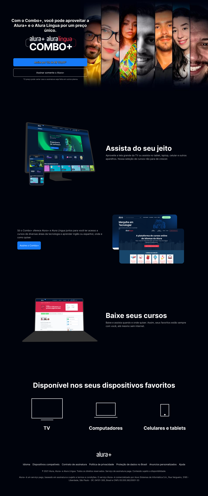

<div align="center">

</div>

## ✳️ Descrição do projeto

 O objetivo desse projeto foi reproduzir a página de Cursos da Alura utilizando **apenas** HTML5 e CSS3 para a renderização, tanto no desktop, quanto em smartphones.

## 🌎 Link do site

https://clone-curso-alura.vercel.app/


## 💻 Tecnologias utilizadas 

Projeto foi desenvolvido utilizando as seguintes tecnologias:

- Linguagem HTML e CSS.

## ▶️ Como executar o projeto

- Clonar o repositório 

``` sh
https://github.com/EduardoPSRodrigues/CloneCursoAlura.git
```

- Instalar a extensão Live Server - v5.7.9 de Ritwick Dey

- Depois no canto inferior direito selecionar Go Live para iniciar o servidor


|    Autor    |  GitHub   |   Linkedin  | 
|  :---: | :---:  | :---: |
|   | Eduardo Rodrigues :: [@EduardoPSRodrigues](https://github.com/EduardoPSRodrigues) | [Meu Perfil](https://www.linkedin.com/in/eduardo-rodrigues-a1a0792a4/) |
